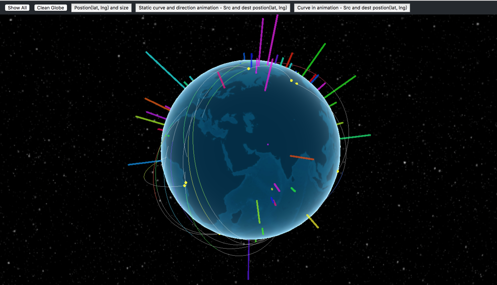

# threeJS-webGL-globe

Practice of 3D globe with some anmations.
[Online Website](https://ashleyyang0610.github.io/threeJS-webGL-globe/)

## Features
1. 3D Globe.
2. Latitude Longitude visualizaion with each size.
3. Source postion (latitude longitude) to detination position (latitude longitude) in Static curve.
4. Source postion (latitude longitude) to detination position (latitude longitude) in animated curve.
5. Perspective control.

## Requirements
* Suuported Browser: Chrome, Firefox, Safari, IE11, Edge.

### Tools or Libraries
* [three.js](https://threejs.org/)

### Other Reference
* [Make the Earth in WebGL](https://github.com/cheton/notes/blob/master/Make%20the%20Earth%20in%20WebGL.md)
* [webgl-globe](https://github.com/dataarts/webgl-globe)
